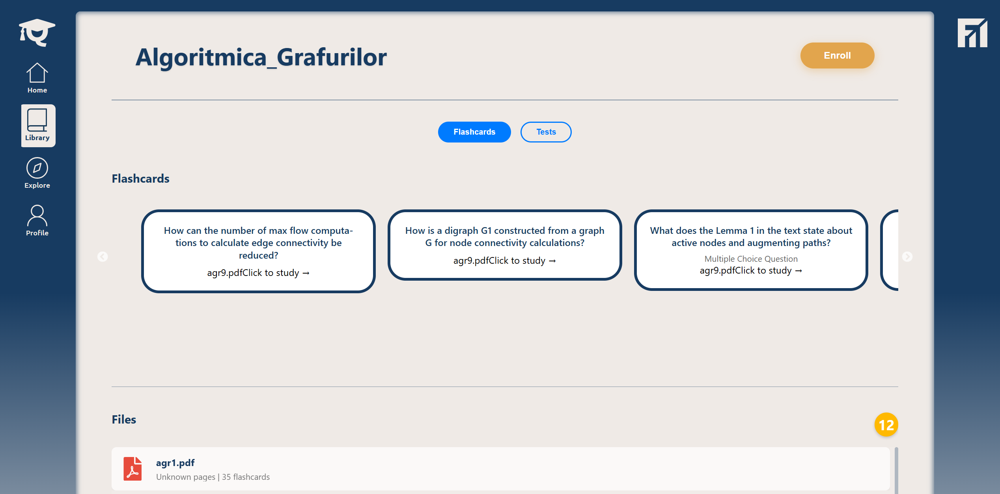
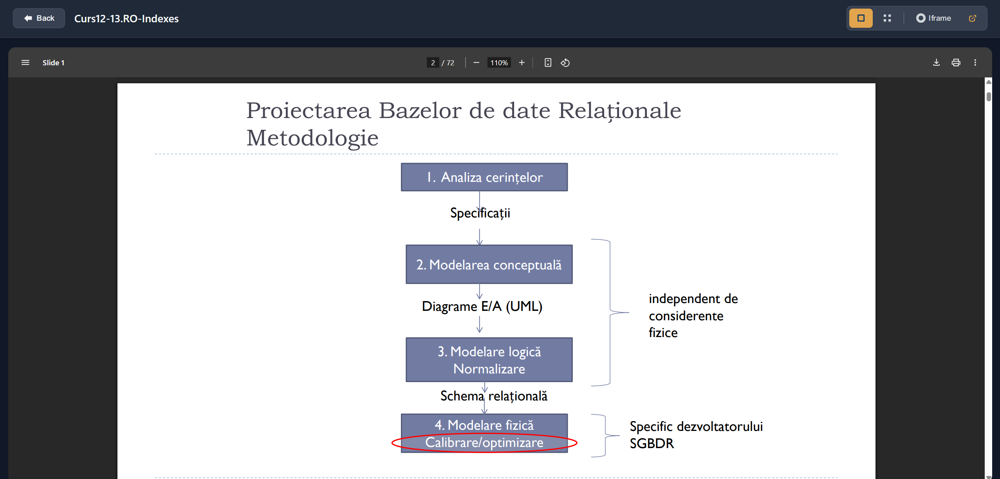
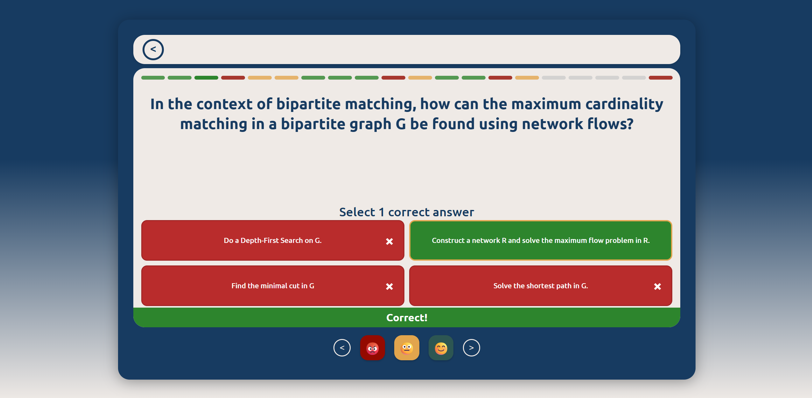

# Quizzy

Quizzy is a web application designed to help students prepare for their bachelor final exams. This platform provides interactive learning through AI-generated quizzes and flashcards tailored to the course material. Students can also access course PDFs directly from the site, making it a comprehensive study companion.

Quizzy is a collaborative group project developed as part of a Software Development course, involving a team of 30 members. Utilized the SCRUM methodology for agile project management to ensure effective collaboration and timely delivery.

---

## Features

- **AI-Generated Quizzes:** Personalized quizzes to test and reinforce your knowledge.
- **AI-Generated Flashcards:** Quickly review key concepts with automatically created flashcards.
- **Course Material Access:** Download and view your course PDFs anytime.
- **User-Friendly Interface:** Modern, responsive design for an optimal learning experience.

---

## Screenshots

**Login Screen**  
The login screen provides a secure and welcoming entry point for students to access the Quizzy platform.  


**Home Dashboard**  
The home dashboard gives students an overview of their progress, upcoming exams, and quick access to learning materials.  


**Course PDF Viewer**  
Easily access and read course material PDFs within the platform, so all study resources are in one place.  


**Quiz Interface**  
Engage with AI-generated quizzes that adapt to your learning pace and help reinforce key concepts.  


---

## Technologies Used

- **Backend:** Java SpringBoot
- **Frontend:** Vite + React
- **Containerization:** Docker
- **CI/CD:** GitHub Actions
- **Cloud Infrastructure:** Amazon AWS  
  (Services: EC2, S3, ECR, RDS, CloudWatch, and more)

---

## DevOps & Cloud Architecture

As part of the DevOps team, I contributed to designing and implementing the cloud architecture and essential services for Quizzy. Our infrastructure leverages several AWS services to ensure reliability, scalability, and security:

- **EC2:** Hosts our backend and frontend applications using Docker containers, enabling scalable compute resources.
- **S3:** Stores files and assets, including course PDFs, for reliable and cost-effective storage.
- **ECR:** Serves as a container registry to manage and version Docker images.
- **RDS:** Provides a managed, scalable, and secure relational database.
- **CloudWatch:** Facilitates monitoring, logging, and alerting across all AWS resources.

We used **Docker** to containerize both the frontend and backend, ensuring consistent environments for development, testing, and production. Docker Compose is used for orchestrating multi-service development environments.

### CI/CD Pipeline

Our CI/CD pipeline is orchestrated with **GitHub Actions** and designed for robustness and automation:

- **Continuous Integration:**  
  On every push and pull request, Maven JUnit unit tests are automatically run to guarantee code quality and prevent regressions.
- **Continuous Deployment:**  
  When code is merged into the `main` branch:
  1. The application is built and Docker images are created.
  2. If the build succeeds, Docker images are pushed to **AWS ECR** as a backup and for version control.
  3. The latest Docker image is then deployed to our **EC2** instances, ensuring the running application is always up-to-date.

### Security & Access Control

- **Branch Protection:**  
  GitHub branches are protected to maintain code integrity. Force pushes are disabled, and direct pushes to protected branches are not allowed. Merging into `main` requires a Pull Request (PR) that must be reviewed and approved by at least one other team member **plus a DevOps team member** before merging.
- **IAM Security:**  
  We implement strict IAM (Identity and Access Management) policies using secured IAM accounts. Each service and user is assigned minimal necessary permissions, following the principle of least privilege.

These practices ensure that our deployment processes are automated, traceable, and secure, and that only thoroughly reviewed and tested code reaches production.

---

# Setup Docker

## Instalare

- **Windows**: Instalează [Docker Desktop](https://www.docker.com/products/docker-desktop) și pornește-l.
- **macOS**: Instalează [Docker Desktop](https://www.docker.com/products/docker-desktop) și pornește-l.
- **Linux**: Instalează Docker Engine și Docker Compose ([ghid aici](https://docs.docker.com/engine/install/)).


## Cum rulezi proiectul

1. Asigură-te că Docker este pornit.
2. Deschide un terminal.
3. Mergi în folderul principal al proiectului (cel care conține fișierul `docker-compose.yml`).
4. Rulează comanda:

   ```bash
   docker compose up --build -d
   ```

Aceasta va porni automat:
- baza de date
- backend-ul (disponibil pe [http://localhost:3000](http://localhost:3000))
- frontend-ul (disponibil pe [http://localhost:36882](http://localhost:36882))

Pentru a opri serviciile:

```bash
docker compose down
```

Pentru a opri serviciile si pentru a reseta baza de date:

```bash
docker compose down --volumes
```
